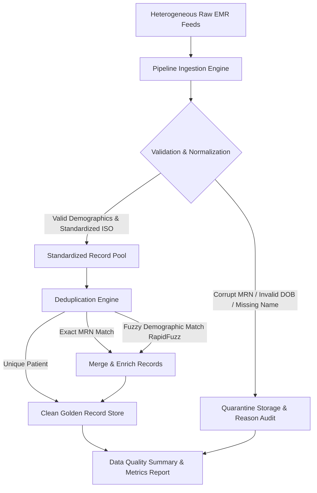

# 🏥 Healthcare Patient Data Cleansing & Normalization Pipeline

[](https://www.python.org/downloads/)
[](https://docs.pydantic.dev/)
[](https://pandas.pydata.org/)
[](https://opensource.org/licenses/MIT)

An enterprise-grade, production-ready Python data pipeline designed to ingest, cleanse, standardize, and deduplicate messy Electronic Health Record (EHR/EMR) patient datasets across fragmented clinical feeds.

---

## 🎯 Problem Statement
Healthcare data ingested from multiple hospital EMR systems is notoriously corrupted and heterogeneous:
- **Inconsistent Dates:** Mixed formats (`MM/DD/YYYY`, `YYYY-MM-DD`, Epoch seconds, invalid dates).
- **Messy Demographics:** Non-standard phone numbers, informal address strings, salutations embedded in name fields (`Dr.`, `MD`, `Jr.`), and fragmented gender categorizations.
- **Corrupted Identifiers:** Missing or invalid Medical Record Numbers (MRNs).
- **Duplicate Patient Profiles:** Re-admitted patients registered under slight typographical variations or alternative contact records, skewing analytics and clinical care continuity.

This pipeline automates normalization, enforces strict Pydantic schemas, routes corrupted records to an audited quarantine queue, and deduplicates patient identities using hybrid deterministic and fuzzy matching.

---

## 🏗️ Architecture & Pipeline Flow



---

## 🚀 Key Features
- **Multi-Format Date Standardizer:** Auto-detects and converts dates to ISO 8601 (`YYYY-MM-DD`), filtering out impossible historical dates.
- **Demographic Cleanser:** Cleans and validates phone numbers (E.164 `+1-XXX-XXX-XXXX`), US ZIP codes, email formats, and maps gender to standardized HL7/FHIR codes (`M`, `F`, `O`, `U`).
- **Pydantic V2 Integrity Routing:** Invalid records are automatically routed to a JSON quarantine log with exact failure codes (`ERR_INVALID_MRN`, `ERR_INVALID_DOB`, `ERR_MISSING_NAME`).
- **Hybrid Deduplication Engine:** Combines exact MRN indexing with composite fuzzy matching across first/last names, birth dates, and address/phone records.
- **Data Quality KPI Auditor:** Generates automated executive summary tables measuring completeness, validity, yield rate, and defect distributions.
- **Synthetic EHR Generator:** Includes a built-in realistic mock EHR generator with configurable defect rates for benchmarking.

---

## 🛠️ Tech Stack
- **Language:** Python 3.11+
- **Data Processing:** Pandas, Python standard library
- **Schema & Validation:** Pydantic v2
- **Fuzzy Matching:** RapidFuzz
- **CLI & Reporting:** Tabulate
- **Unit Testing:** Pytest

---

## 📦 Project Structure

```
healthcare-patient-data-pipeline/
├── data/
│   ├── raw/                # Ingested raw EMR feeds
│   ├── processed/          # Clean golden patient records (CSV)
│   └── quarantine/         # Quarantined invalid records with error logs (JSON)
├── reports/                # Data quality audit reports
├── src/
│   ├── __init__.py
│   ├── config.py           # Configuration & threshold constants
│   ├── schema.py           # Pydantic models for raw, clean, and quarantine records
│   ├── cleaners.py         # Modular normalization functions
│   ├── deduplicator.py     # Deterministic & fuzzy patient matching
│   ├── generator.py        # Realistic dirty synthetic EHR data generator
│   ├── metrics.py          # Data quality KPI calculation & reporting
│   └── pipeline.py         # Core ETL pipeline orchestrator
├── tests/
│   ├── test_cleaners.py    # Unit tests for normalization functions
│   ├── test_deduplicator.py# Unit tests for deduplication & merging
│   └── test_pipeline.py    # End-to-end integration tests
├── requirements.txt
├── run_pipeline.py         # CLI entry point
└── README.md
```

---

## ⚡ Quickstart & Usage

### 1. Installation
```bash
git clone https://github.com/mshahidhere3/healthcare-patient-data-pipeline.git
cd healthcare-patient-data-pipeline
pip install -r requirements.txt
```

### 2. Launch Interactive Web Dashboard (Streamlit)
```bash
streamlit run app.py
```
*Opens in your browser at `http://localhost:8501` featuring drag-and-drop EMR CSV upload, before/after comparison tables, quarantine audit logs, and a live normalization playground.*

### 3. Deploy Live on Streamlit Community Cloud (Free Shareable URL)
1. Go to [share.streamlit.io](https://share.streamlit.io/) and sign in with GitHub.
2. Click **New app** and select `mshahidhere3/healthcare-patient-data-pipeline`.
3. Set Main file path to `app.py` and click **Deploy**.
4. You will get a permanent public URL (e.g. `https://patient-data-pipeline.streamlit.app`) to share with hospitals, recruiters, or clients.

### 4. Run CLI Pipeline with Synthetic Data
Generate 500 dirty synthetic patient records and run full ETL cleansing and audit:
```bash
python run_pipeline.py --generate-sample 500
```

### 5. Run Automated Test Suite
```bash
pytest tests/ -v
```

---

## 📊 Sample Data Quality Audit Report

```
============================================================
      HEALTHCARE PATIENT DATA QUALITY AUDIT REPORT
============================================================
+---------------------------------+---------+
| Metric                          | Value   |
+=================================+=========+
| Total Raw Ingested              | 525     |
| Clean Records Produced          | 478     |
| Duplicates Detected & Merged    | 24      |
| Corrupt Records Quarantined     | 23      |
| Clean Data Yield Rate           | 91.05%  |
| Data Quality Net Health         | 95.62%  |
+---------------------------------+---------+

Top Quarantine Defect Breakdown:
Error Reason Code      Count
-------------------  -------
ERR_INVALID_DOB           12
ERR_INVALID_MRN            8
ERR_MISSING_NAME           3
============================================================
```

---

## 👤 Author
**Muhammad Shahid**
- LinkedIn: [linkedin.com/in/mshahidhere3](https://linkedin.com/in/mshahidhere3)
- GitHub: [@mshahidhere3](https://github.com/mshahidhere3)
- Role: Data Engineer / Python Developer
